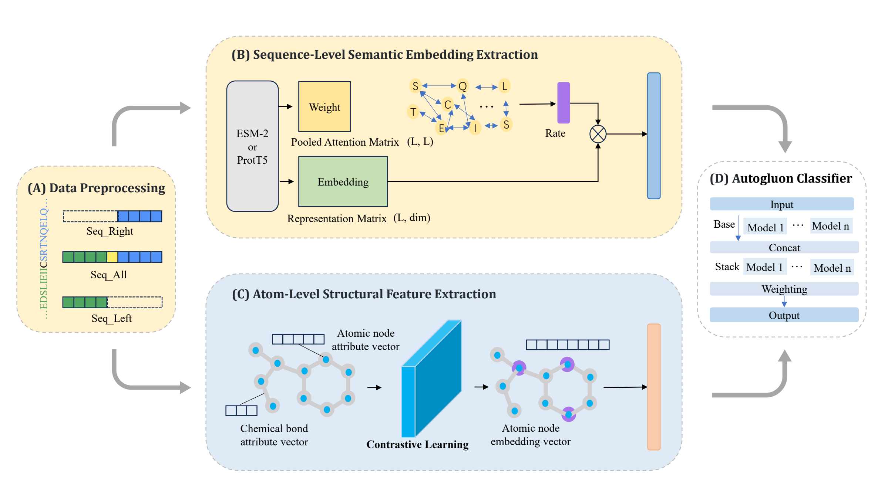

# CysMoNet: Joint prediction of protein S-carboxyethylation and S-sulfhydration sites based on sequence–atomic-level structural cross-modal representation and automated machine learning

## Overview
CysMoNet is a deep learning framework for the joint prediction of protein S-carboxyethylation and S-sulfhydration sites. The method integrates sequence-atomic-level structural cross-modal representations with automated machine learning to achieve accurate and robust predictions.


*Figure 1: The overall architecture of CysMoNet*

## Dependencies
This project requires the following dependencies:

- `autogluon` == 0.5.2
- `dill` == 0.3.4
- `fair_esm` == 2.0.0
- `joblib` == 1.1.0
- `numpy` == 1.21.2
- `pandas` == 1.3.5
- `rdkit` == 2022.9.5
- `setuptools` == 59.8.0
- `tqdm` == 4.62.2
- `pytorch` == 1.12.1
- `torchvision` == 0.13.1
- `torchaudio` == 0.12.1
- `cudatoolkit` == 11.3

### Installation
To install the dependencies, you can run:

```bash
pip install -r requirements.txt
```

## Datasets
This repository contains two benchmark datasets:

- **S-sulfhydration sites**: `./dataset/data/` - Collected from the iCysMod database
- **S-carboxyethylation sites**: `./dataset/data_2/` - Benchmark dataset from the DLBWE-Cys paper

## Feature Generation
Three main types of features are included in this repository:

- **Atomic-level structural features**: Pre-trained using self-supervised contrastive learning framework
- **Evolutionary information**: BLOSUM62 matrix
- **Large language model embeddings**: ProtT5, ProtBert, and ESM-2

The feature generation code can be found in the `./feature/` directory.

## Training
To train a new model, use the following command:

```bash
python main.py \
  --all_pos <positive_samples_file> \
  --all_neg <negative_samples_file> \
  --emb_all <full_embeddings_file> \
  --emb_left <left_embeddings_file> \
  --emb_right <right_embeddings_file> \
  --mode <a|b|c|d> \
  --outdir <output_directory> \
  --time_limit <seconds> \
  --seed <integer>
```

### Parameter Description
- `--all_pos`: Path to positive samples file for training and validation 
- `--all_neg`: Path to negative samples file for training and validation 
- `--emb_all`: NPZ file path for full-sequence embeddings
- `--emb_left`: NPZ file path for left subsequence embeddings
- `--emb_right`: NPZ file path for right subsequence embeddings
- `--mode`: Negative sampling mode, choices: [`a`, `b`, `c`, `d`]
- `--outdir`: Output directory for results (default: `results`)
- `--time_limit`: Time limit for AutoGluon in seconds (default: `600`)
- `--seed`: Random seed (default: `42`)

## Testing
To evaluate a trained model on an independent test set, use the following command:

```bash
python test.py \
  --all_pos <train_val_positive_file> \
  --all_neg <train_val_negative_file> \
  --test_pos <test_positive_file> \
  --test_neg <test_negative_file> \
  --emb_all <full_embeddings_file> \
  --emb_left <left_embeddings_file> \
  --emb_right <right_embeddings_file> \
  --mode <a|b|c|d> \
  --outdir <output_directory> \
  --time_limit <seconds> \
  --seed <integer>
```

### Additional Parameters for Testing
- `--test_pos`: Path to external independent positive samples file for testing
- `--test_neg`: Path to external independent negative samples file for testing
